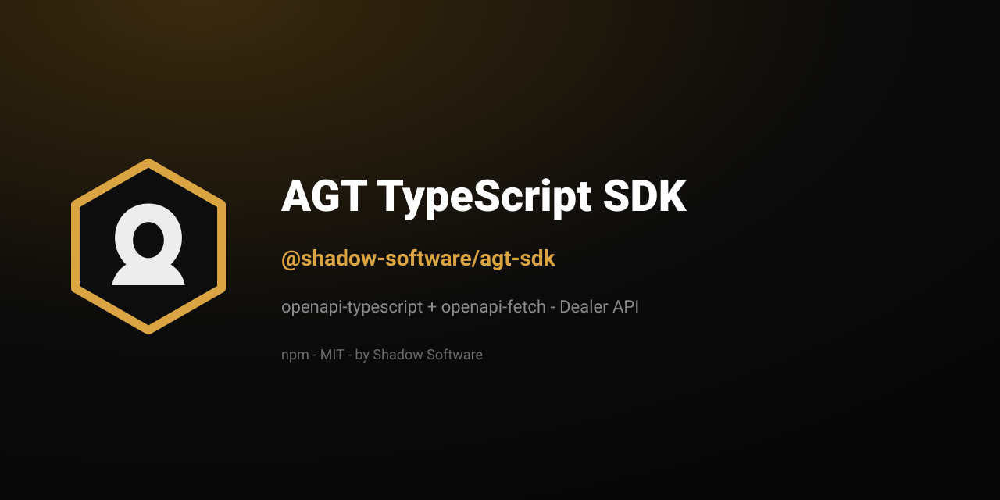

<p align="center">
  
</p>

<h1 align="center">AGT TypeScript SDK</h1>

<p align="center">
  <strong>Official TypeScript client for the
  <a href="https://americanguntrader.com/">American Gun Trader</a> Dealer API.</strong><br>
  Typed with <code>openapi-typescript</code> + <code>openapi-fetch</code>.
</p>

<p align="center">
  <a href="https://www.npmjs.com/package/@shadow-software/agt-sdk"></a>
  
  <a href="https://shadowsoftware.com/"></a>
</p>

<p align="center">
  <b><a href="https://americanguntrader.com/">Platform</a></b>
  &nbsp;·&nbsp;
  <a href="https://americanguntrader.com/docs/dealer-api">API docs</a>
  &nbsp;·&nbsp;
  <a href="https://packagist.org/packages/shadow-software/agt-php-sdk">PHP SDK</a>
  &nbsp;·&nbsp;
  <a href="https://github.com/shadow-software/agt-for-woocommerce">WooCommerce plugin</a>
</p>

---

## Install

```bash
npm install @shadow-software/agt-sdk
```

Git installs compile through the package's `prepare` script. With npm 12, pin the
commit and allow its build script if your policy requires it — see
[npm's Git and script policy](https://docs.npmjs.com/cli/install/).

## Usage

```ts
import { createAgtDealerClient } from "@shadow-software/agt-sdk";

const client = createAgtDealerClient({
  apiKey: process.env.AGT_API_KEY!,
  // baseUrl defaults to https://americanguntrader.com/api/v1/dealer
});
```

`src/generated/` is regenerated from the OpenAPI spec — do not edit by hand.
Releases are produced by
[`shadow-software/sdk-release`](https://github.com/shadow-software/sdk-release).

## License

[MIT](LICENSE) © [Shadow Software LLC](https://shadowsoftware.com/).

---

## AGT ecosystem

| | |
|---|---|
| [americanguntrader.com](https://americanguntrader.com) | Marketplace & dealer accounts |
| [Dealer API docs](https://americanguntrader.com/docs/dealer-api) | API reference & OpenAPI spec |
| [`shadow-software/agt-php-sdk`](https://packagist.org/packages/shadow-software/agt-php-sdk) | PHP SDK (Packagist) |
| [AGT Sync for WooCommerce](https://github.com/shadow-software/agt-for-woocommerce) | WordPress / WooCommerce plugin |

<p align="center">
  <sub><a href="https://shadowsoftware.com/">shadowsoftware.com</a> · MIT · © 2026 Shadow Software LLC</sub>
</p>
